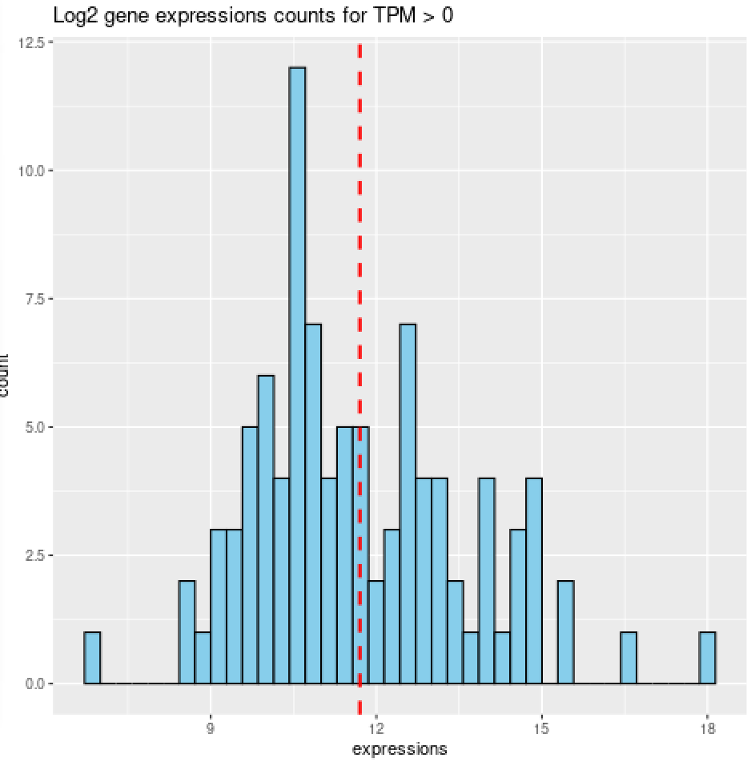
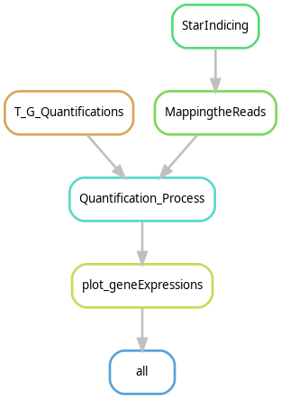

# Find Gene Expressions pipeline

This pipeline is build by following the steps in the following [article](https://link.springer.com/protocol/10.1007/978-1-4939-4035-6_14#Sec5). Three main output files are created:

    1. Annotated transcript expressions: Quant.isoforms.results (TSV)
        - File with lots of columns, but the following are most interesting: transcript ids, 
        two different measure columns of expressions (TPM and FPKM) and read counts in a given transcript.
        
    2. Gene quantification expressions: Quant.genes.results     (TSV)
        - Same as the 'isoforms' file, but holds gene ids, expressions of genes and read counts for a given gene. 
        
    3. Histogram of number of genes found with expression activity: TPM_gene_expressions (PNG)
<details>
    <summary>Show example of a created histogram</summary>
    


*On the x-axis are log2 expressions values of genes, with a value larger than 0.* \
*On the y-axis are the counts of genes with a given expression.* \
*The data is taken from the TPM column that holds gene expressions from the Quant.genes.results file.* 

</details>
## The pipeline

This pipeline walks in 6 steps called rules. Leading to a final histogram file showing counts of genes with expression found in your reads.


1. include: "workflow/rules/STARindices.smk"

2. include: "workflow/rules/Mapping_the_Reads.smk"

3. include: "workflow/rules/transcriptome_reconstruction_assembly.smk"

4. include: "workflow/rules/transcript_gene_quantifications.smk"

5. include: "workflow/rules/Quantifying_process.smk"

6. include: "workflow/rules/plot_geneExpressions.smk"


<details open>
    <summary>Show/Collapse workflow</summary>


    
</details>

## Installation

> Below all required software is listed. Dependencies are retrieved by snakemake and are NOT required to manually install.

What is required to install are **conda, snakemake and R**. All buttons are clickable and will redirect you to the software website. Installation of R and Conda are ambiguous to your system, but their buttons will direct you to a linux installation guide. Since this pipeline was made in linux.

## dependencies


**Dependency file can be found at workflow/rules/envs/getTools.yaml**

name: tools \
channels: \
    - bioconda              
    - conda-forge
    
dependencies: 
  - [](https://anaconda.org/bioconda/star)
  - [](https://anaconda.org/bioconda/samtools)
  - [](https://anaconda.org/bioconda/cufflinks)
  - [](https://anaconda.org/bioconda/rsem)
    
requirements (install guide - clickable):
   - [](https://cran.r-project.org/bin/linux/ubuntu/fullREADME.html#installation)
   - [](https://conda.io/projects/conda/en/latest/user-guide/install/linux.html)
   - [](#snakemake-installation) 


## Conda installation

<details open>
    <summary>Snakemake install guide</summary>

1. Install Miniconda
```ruby
wget https://repo.anaconda.com/miniconda/Miniconda3-latest-Linux-x86_64.sh
```
```ruby 
bash Miniconda3-latest-Linux-x86_64.sh
```

*The .sh file is retrieved from the link with wget, but the file can also be downloaded by visiting the webpage and clicking the download button* 
**While running bash <command> accept all default settings**

2. Test conda installation
*Refresh your terminal session. Then type the following:*
```ruby
conda list
```    
*No installed packages as output? Revise your installations steps, by following the guide from the official website* 

3. Update conda (if necessary)
```ruby
conda update conda
```

</details>

## Snakemake installation

<details open>
    <summary>Create conda environement</summary>

*After -n specify the name of the conda environment you want to create*
```ruby
conda create -n snakemake_environment 
```

*Forgot the conda env name after creating? *
```ruby
conda env list  
```

*Activate your environment*
```ruby
conda activate snakemake_enviroment
```

*Snakemake will be installed through bioconda and conda-forge*
```ruby
conda install -c conda-forge -c bioconda snakemake  
```
*Do you want the snakemake version used in this pipeline? Specify snakemake=<version> i.e. snakemake=8.9.0*

*Tell snakemake to use conda*
```ruby
snakemake -c 30 --use-conda --conda-frontend conda
```
*Snakemake assumes mamba to be used as default, but since we've downloaded conda it must be specified.* \
*If you've killed the process resulting in unfinished meta data, add the --ri flag to the command (rerun incomplete)*

</details>

## Parameter set up

Note that large files are used and created for this pipeline! 
Namely the genome file (as input) and its index file (created in the first rule). These files can easily sum to 30 gb. 

    
> In config.yaml you can change the parameters to your situation. Uncollapse the block below to see what the parameters mean.

<details>
    <summary>Parameter definition/purpose.</summary>
        
1. fastq_file
```ruby
fastq_file: /students/2023-2024/Thema05/humanGenome/materials/first_10000_records.fastq.gz
#This pipeline is made for two fastq read files as input, i.e. fastq_file, fastq_file2
fastq_file2: /students/2023-2024/Thema05/humanGenome/materials/first_10000_RED_lines.fastq.gz
```
2. Genome index folder
```ruby
StargenomeDir: /students/2023-2024/Thema05/humanGenome/materials/StargenomeDir/
#Directory you want your ~ 20-30 gb index file to be stored, when created
genome: /students/2023-2024/Thema05/humanGenome/materials/male.hg19.fa
#Directory you want your genome file to be stored (must be unpacked i.e. not zipped)
```
3. Annotation file of given genome.
```ruby
annotationGTF: /students/2023-2024/Thema05/humanGenome/materials/gencode.v19.annotation.gtf
```

5. Output Directory
```ruby
output_dir: /students/2023-2024/Thema05/humanGenome/materials/
#Directory where in between files are made leading to the final output.
#Per rule a directory is created to store its created output
```

6. Directory for histogram to be redirected to.
```ruby
histogram: plot/
#Histogram of genes counts with expressions larger than zero
```

</details>

## Run snakemake pipeline

<details open>
    <summary>How to run this pipeline</summary>

snakemake -c <cores>. Choose the number of cores suited for your device. 
Or type -c -all, to select all cores available.
```ruby
snakemake -c 4
```

</details>
